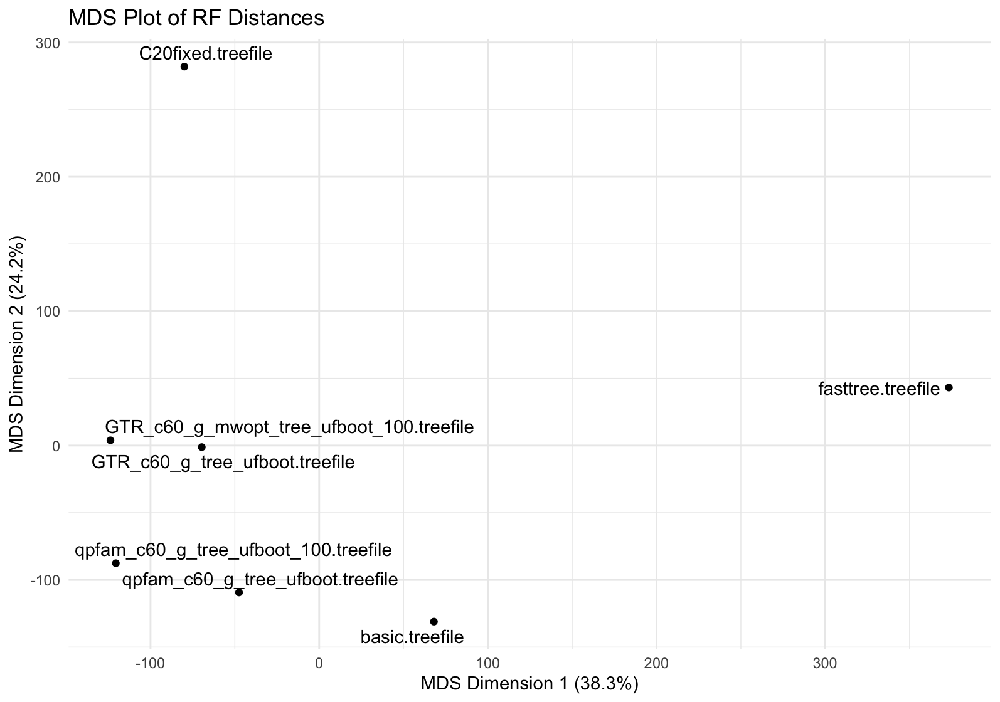

# Patescibacteria

Details of the analysis are in the analysis folder. Here's a summary

## Results


### Model Fit

AICs are approx because they don't account for parameters estimated in earlier steps. These can be ~300 parameters (rate matrix, plus ~60 profile weights). 

| ID  | LnL   | AIC(approx) | Tree Length | % internal | BS: med;mean;%>90;%>95;%>99 |  Total Time (tree) | Total Time (UFBoot) | Summary  |
|-----|-------|-----------|----------|-------|-----|-----|-|----|
| 1 | -5457790 | 10921981 | 487 | 27.5678% | NA | 24h:1m:14s | NA |  `-m C20`, that's it |
| 2 | -5327202 | 10660842 | 713 | 27.5436% | 100; 96; 88.5%; 83.7%; 72.7% | 9h:21m:28s | 11h:30m:51s |  PMSF with Q.pfam+C60+G on the full dataset |
| 3 | -5381055 | 10768548 | 668 | 28.0951% | 100; 95; 87.5%; 82.4%; 73.0% | 7h:54m:1s | 11h:48m:28s | PMSF as for 2 but site freqs all done from 100 random taxa |
| 4 | -5306068 | 10618575 | 525 | 27.8594% | 100; 95; 87.8%; 84.2%; 73.9% | 11h:13m:38s | 9h:42m:18s | GTRPmix PMSF with parameters from a 100 taxon subset, using `-mwopt` and `GTRPMIX` |
| 5 | -5273916 | 10554270 | 549 | 27.6307% | 100; 96; 88.7%; 84.7%; 75.7% | 9h:53m:56s | 7h:28m:48s | GTRPmix PMSF with parameters from a 100 taxon subset, using `-mwopt` and `GTRPMIX`, but site freqs from the whole dataset |
| 6 |  |  |  |  |  |  |  | |


#### Tree distances

How close are the trees after all this work??

`basic.treefile` is just Q.pfam+G




This shows that the (poorly named) GTR+C60 trees with mwopt trees are very similar (rf dist 270)

This MDS is done from RF distances as follows:

```
cat fasttree.treefile \
	C20fixed.treefile \
	basic.treefile \
	qpfam_c60_g_tree_ufboot.treefile \
    qpfam_c60_g_tree_ufboot_100.treefile \
    GTR_c60_g_mwopt_tree_ufboot_100.treefile \
    GTR_c60_g_mwopt_tree_ufboot.treefile \
     > all_trees.tre

iqtree  -rf_all all_trees.tre -pre rf_distance_matrix

```

The resulting matrix is:

```
0 528 416 490 540 524 498
528 0 462 430 424 366 380
416 462 0 314 356 344 314
490 430 314 0 318 318 328
540 424 356 318 0 316 364
524 366 344 318 316 0 270
498 380 314 328 364 270 0
```


## The analyses

### 1. C20

Just C20 on the full dataset. Nothing complex. But a good starting point.
Starting tree is the FastTree tree.

``` {bash}
#### C20 on the full dataset
iqtree -s alignment.faa -t subtree_topology_clean.nwk -m C20 -nt 60 -safe -pre C20fixed
```

Time: 24h:1m:14s

This takes a while! Because C20 means a lot of likelihoods.

### 2. PMSF with Q.pfam+C60+G

Standard PMSF with the most complex model we can realistically do on a huge dataset. I.e. no optimising weights.

```{bash}
#### Estimate PMSF on the full dataset: bacteria
# 1. Basic analysis to get the tree
iqtree -s alignment.faa -t subtree_topology_clean.nwk -m Q.pfam+G -nt 60 -safe -pre basic
# get the site frequencies
iqtree -s alignment.faa -ft basic.treefile -m Q.pfam+C60+G -nt 60 -safe -pre qpfam_c60_g_sf -n 0
# apply them with +G
iqtree -s alignment.faa -fs qpfam_c60_g_sf.sitefreq -t basic.treefile -m Q.pfam+C60+G -nt 60 -safe -pre qpfam_c60_g_tree_noboot
# apply them with +G and UFBOOT
iqtree -s alignment.faa -fs qpfam_c60_g_sf.sitefreq -t basic.treefile -m Q.pfam+C60+G -nt 60 -safe -pre qpfam_c60_g_tree_ufboot -bb 1000

```

Timing:

1. 4h:23m:8s
2. 0h:2m:1s
3. 4h:56m:19s
4. 7h:5m:42s

Observations: it's the tree search which takes all the time. And C60 PMSF is almost just as quick as Q.pfam+G, as expected. Also, UFBOOT roughly doubles the time. 


### 3. Q.pfam+C60+G PMSF with parameters from a 100 taxon subset

The point here is a fairly direct comparison with the above. I estimate the site frequencies themselves on a subset of 100 taxa, then apply them to the full dataset. 

> NB: 100 was my plan, but because I sampled taxa from the full list, I actually ended up with 41 taxa here!! 

```{bash}
#### Estimate PMSF on a 100 taxon dataset: bac3
# 1. get the tree with C60
iqtree -s alignment_100.faa -t subtree_100_topology_clean.nwk -m Q.pfam+C60+R8 -nt 60 -safe -pre 100_tree
# turns out that the R8 distributino looks very gamma-like, so I will switch to gamma
# get the site frequencies
iqtree -s alignment_100.faa -ft 100_tree.treefile -m Q.pfam+C60+G -nt 60 -safe -pre qpfam_c60_g_sf_100 -n 0
# apply them to the FULL alignment (using the same starting tree as before)
iqtree -s alignment.faa -fs qpfam_c60_g_sf_100.sitefreq -t basic.treefile -m Q.pfam+C60+G -nt 60 -safe -pre qpfam_c60_g_tree_noboot_100
# apply them to the FULL alignment with UFBOOT (using the same starting tree as before)
iqtree -s alignment.faa -fs qpfam_c60_g_sf_100.sitefreq -t basic.treefile -m Q.pfam+C60+G -nt 60 -safe -pre qpfam_c60_g_tree_ufboot_100 -bb 1000
```

Note that the timing for step 1 is long, and off, because I tried an R8 model. 

1. 2h:42m:58s
2. 0h:0m:3s
3. 5h:11m:0s
4. 9h:5m:27s

Observations: not sure why this PMSF analysis took so much longer. Worse model fit? As expected, the lnL is lower. But it's not a LOT lower. So that's encouraging! This suggests we could try doing site profiles from super fancy models on a subset. Let's see how that goes.


### 4. GTRPmix PMSF with parameters from a 100 taxon subset, using `-mwopt` and `GTRPMIX`

The idea is that maybe a super fancy model on a small subset gives better site frequencies than a simpler model on the full data. Let's see.

> NB: 100 was my plan, but because I sampled taxa from the full list, I actually ended up with 41 taxa here!! 


```{bash}
#### GTRpmix on 100 taxon dataset, attempt with mwopt: bac2
# 1. Get the tree with C60 - take it from 100_tree above
# 2. Estimate GTR+C60 with mwopt
iqtree -s alignment_100.faa -m GTR20+C60+G4 --link-exchange --init-exchange q.pfam -te 100_tree.treefile -me 0.99 -nt 60 -safe -mwopt -pre GTR_c60_g_mwopt
# 3. get the site frequencies
iqtree -s alignment_100.faa -ft 100_tree.treefile -m GTRPMIX+C60+G4 -mdef GTR_c60_g_mwopt.GTRPMIX.nex -nt 60 -safe -pre GTR_c60_g_mwopt_sf_100 -n 0
# 4. apply them to the FULL alignment (using the same starting tree as before), then try ufboot
iqtree -s alignment.faa -fs GTR_c60_g_mwopt_sf_100.sitefreq -t basic.treefile -m GTRPMIX+C60+G4 -mdef GTR_c60_g_mwopt.GTRPMIX.nex -nt 60 -safe -pre GTR_c60_g_mwopt_tree_noboot_100
iqtree -s alignment.faa -fs GTR_c60_g_mwopt_sf_100.sitefreq -t basic.treefile -m GTRPMIX+C60+G4 -mdef GTR_c60_g_mwopt.GTRPMIX.nex -nt 60 -safe -pre GTR_c60_g_mwopt_tree_ufboot_100 -bb 1000

```

Timing:

1. 2h:42m:58s
2. 2h:53m:12s
3. 0h:0m:2s
4. 5h:37m:26s
5. 4h:6m:6s

Observations: best likelihood yet! So this works. Also, the tree lenght is a lot shorter, so I'm not sure what to think of that. Less LBA perhaps? 


### 5. GTRPmix PMSF with parameters from a 100 taxon subset, using `-mwopt` and `GTRPMIX`, but site freqs from the whole dataset

The point here is that the site frequency calculation is super fast, so it's dumb to get this from the 100 taxon subset.

> NB: 100 was my plan, but because I sampled taxa from the full list, I actually ended up with 41 taxa here!! 


```{bash}
#### GTRpmix on 100 taxon dataset, site freqs on the whole thing? bacteria
# 1. Get the tree with C60 - take it from 100_tree above
# 2. Estimate GTR+C60 with mwopt: as above
# 3. get the site frequencies
iqtree -s alignment.faa -ft basic.treefile -m GTRPMIX+C60+G4 -mdef GTR_c60_g_mwopt.GTRPMIX.nex -nt 60 -safe -pre GTR_c60_g_mwopt_sf -n 0

# 4. apply them to the FULL alignment (using the same starting tree as before), then try ufboot
iqtree -s alignment.faa -fs GTR_c60_g_mwopt_sf.sitefreq -t basic.treefile -m GTRPMIX+C60+G4 -mdef GTR_c60_g_mwopt.GTRPMIX.nex -nt 60 -safe -pre GTR_c60_g_mwopt_tree_noboot
iqtree -s alignment.faa -fs GTR_c60_g_mwopt_sf.sitefreq -t basic.treefile -m GTRPMIX+C60+G4 -mdef GTR_c60_g_mwopt.GTRPMIX.nex -nt 60 -safe -pre GTR_c60_g_mwopt_tree_ufboot -bb 1000

```

1. 2h:42m:58s
2. 2h:53m:12s
3. 0h:1m:53s
4. 4h:15m:53s
5. 1h:50m:45s

Observations. Best yet. And super odd that the ufboot goes so much quicker than the not-ufboot. Maybe 60 threads is too many on the single analysis. Honestly unsure.

### 6. GTRPmix PMSF with parameters from a 250 taxon subset, using `-mwopt` and `GTRPMIX`, site freqs from the whole dataset

The point here is that a bigger subset should be better for estimating the model

> NB: 250 was my plan, but because I sampled taxa from the full list, I actually ended up with 128 taxa here!! 


```{bash}
#### GTRpmix on 250 taxon dataset, site freqs on the whole thing: bacteria
# 1. Get the tree with C60
iqtree -s alignment_250.faa -t subtree_250_topology_clean.nwk -m Q.pfam+C60+G -nt 60 -safe -pre 250_tree

# 2. Estimate GTR+C60 with mwopt on a 250 subset
iqtree -s alignment_250.faa -m GTR20+C60+G4 --link-exchange --init-exchange q.pfam -te 250_tree.treefile -me 0.99 -nt 60 -safe -mwopt -pre GTR_c60_g_mwopt_250

# 3. get the site frequencies
iqtree -s alignment.faa -ft basic.treefile -m GTRPMIX+C60+G4 -mdef GTR_c60_g_mwopt_250.GTRPMIX.nex -nt 60 -safe -pre GTR_c60_g_mwopt_250_sf -n 0

# 4. apply them to the FULL alignment (using the same starting tree as before), then try ufboot
iqtree -s alignment.faa -fs GTR_c60_g_mwopt_250_sf.sitefreq -t basic.treefile -m GTRPMIX+C60+G4 -mdef GTR_c60_g_mwopt_250.GTRPMIX.nex -nt 60 -safe -pre GTR_c60_g_mwopt_250_tree_noboot
iqtree -s alignment.faa -fs GTR_c60_g_mwopt_250_sf.sitefreq -t basic.treefile -m GTRPMIX+C60+G4 -mdef GTR_c60_g_mwopt_250.GTRPMIX.nex -nt 60 -safe -pre GTR_c60_g_mwopt_250_tree_ufboot -bb 1000

```

1. 


